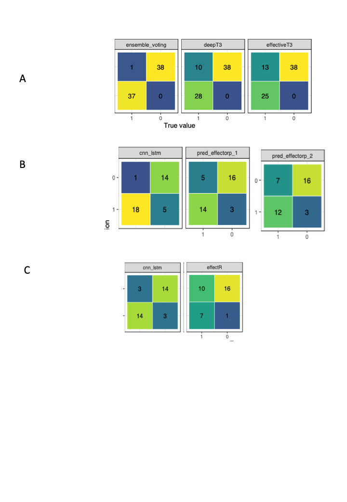

```{r setup, include = FALSE}
library("papaja")
library(dplyr)
library(ggplot2)
library(patchwork)

# Source plotting functions
source("functions/plot_confusion_mat.R")
source("functions/plot_confusion_matrices.R")
source("functions/get_lower_corr_mat.R")
source("functions/get_seqlogo.R")

# ggplot2 global theme
theme_set(theme_bw())
```

```{r analysis-preferences, echo=FALSE}
# Seed for random number generation
set.seed(42)
knitr::opts_chunk$set(cache.extra = knitr::rand_seed)
```

# Introduction

Phytopathogens are a major threat to global crop production.  The fungal phytopathogen _Magnoporthe oryzae_ that causes cereal blast is responsible for around 30% of rice production loss and has now emerged as a pandemic problem on wheat [@Nalley:2016jp] The oomycete _Phytophthora infestans_ causes losses of ~6 billion USD to potato production, annually [@haas2009genome]. The bacterium _Ralstonia solanacearum_ has a wide host range and can cause loses of over 30% in potato, banana and groundnut [@Yuliar:2015hp]. The incidences of crop disease are increasing, global climate change and agricultural practice are expanding the geographical range of pathogens and upping the stakes in the evolutionary arms race.  Effector proteins are the shock troops of infection, manipulating the host at the infection interface to the pathogens advantage. Identifying and characterising a pathogen's effector content is a critical first step in understanding diseases and developing resistance,  but effectors are notoriously difficult to characterise from sequence data. In most phyla they have only a few easily determined sequence characteristics (some in fungi are cysteine rich or have a MAX motif, some in oomycetes have the RXLR motif or WY fold)  but in many cases no sequence identifiers are known [@Franceschetti:2017gc]. Characterising effectors requires painstaking molecular experimental work and genome-scale approaches have relied on complex computational pipelines with in-built _a priori_ assumptions about what might constitute an effector sequence in the absence of sequence features known to group them [@Sperschneider:2015kb]. To understand infection processes, to provide genome-level understanding of the functions of this important class of genes and to develop future disease resisting crop varieties there is a need to identify effectors computationally from genome and protein sequence data.

Machine learning (ML) algorithms are a general group of techniques most often used for classification of data into groups. Supervised ML require a set of training examples and associated data with which to learn. Defining the best data to use and collect, called feature selection is an important and difficult prerequisite.  ML approaches have been applied with success to biological sequence analysis, particularly in transcription factor binding site prediction, for the classification of eukaryote and bacterial nuclear proteins [@Savojardo:2017eq] and in the plant pathogen domain work by Sperschneider et al [@Sperschneider:2018gc] developed two ensemble-based machine learning models that could identify effectors and predict localisation with > 70% accuracy [@effectorp, @effectorp2]. 

Deep learning models are distinct from other machine learning processes in that pre-selection of important features is far less critical and the models can learn these features unsupervised from training data [@Jurtz:2017cr]. This property removes the need to know which properties of a data set must be examined before data collection begins. The Deep learning models can therefore classify on properties not necessarily known to the operator and could be used to uncover cryptic patterns in data. Convolutional neural networks (CNNs) are a type of neural network that have found wide application in numerous machine vision problems, including image object classification and facial identification [@krizhevsky2012, @lawrence1997], in time-series data analysis [@pyrkov2018] and natural language processing [@collobert2008]. In the biomedical domain they have been used in drug discovery [@wallach2015] and gene network prediction [@maclean2019]. In studies with bacterial type III secreted effectors Xue et al developed an accurate CNN classifier for bacterial sequences [@deept3]. CNNs encode information about the features used to classify that can be extracted and interpreted. In a sequence classification problems this means they have the potential to reveal novel sequence features that other bioinformatics approaches have not and could be of particular utility when analysing sets of effectors.  

Deep learning approaches require positive and negative examples from which to learn - here a list of sequences annotated as an effector or not. The larger and more accurate the list the more sensitivity a model can obtain. It is critical that training examples are experimentally verified effectors. Much of the effector annotation in public genomics databases is from computational predictions of genomics and is therefore of experimentally unverified hypothetical effectors. A good source of experimentally verified data is in the Molecular Plant Microbe Interactions (MPMI) literature and The widest ranging manual curation of MPMI papers is being performed as part of the PHI-Base [@phibase] database strategy, PHI-base is an expertly curated database of genes proven experimentally to affect the outcome of pathogen host interactions and is therefore an excellent source of reliable effector sequences.

Here we use combinations of CNNs that do not rely on _a priori_ feature selection to classify experimentally verified effectors and non-effectors in three taxa of plant pathogen: bacterial, fungal and oomycete. We show that these have very strong predictive power, can outperform existing effector prediction methods in accuracy and a better balance of sensitivity and specificity.  We also analyse the activations of the models in response to effectors and non-effectors to gain insights into the sequence features that are allowing classification. We have produced an R package that will allow other scientists to easily classify their own sequences of interest. 


# Methods

## Sequence Data Collection

Sequence data were collected from the PHI-Base database version 4.8 [@phibase] by accessing a text dump of the data kindly prepared on request by the PHI-Base team, the file can be accessed at [https://github.com/PHI-base/data/blob/master/releases/phi-base_current.csv](https://github.com/PHI-base/data/blob/master/releases/phi-base_current.csv). The pipeline in Figure \@ref(fig:effectorcollection) outlines the steps used. We filtered plant effector proteins and their taxonomic groups and collected sequences from UniProt Release 2019_05, using the code in [https://github.com/TeamMacLean/ruth-effectors-prediction/blob/master/scripts/r-scripts/getting-data-new/binary-class/0001_first_step_getting_data.Rmd](https://github.com/TeamMacLean/ruth-effectors-prediction/blob/master/scripts/r-scripts/getting-data-new/binary-class/0001_first_step_getting_data.Rmd). We created a correspondingly sized data set of non-effectors with secretion signals originating in species matched to those from which the effectors were drawn. We downloaded sequences for randomly selected proteins matching these criteria from Ensembl databases [@yates2020] : specifically Ensembl Fungi, Protists and Bacteria manually using the BioMart tools [@smedley2009]. Since the BioMart tool is not available on Ensembl Bacteria, we downloaded whole proteome protein sequnces from species matched to those from which the effector came using FTP. With these we used SignalP 3.0 [@dyrlovbendtsen2004] in order to filter the secreted sequences and selected accordingly. ^[Ruth, what version of the code and what parameter settings did you use?] Redundant sequences were filtered using BLASTp [@camachoblast2009]. We achieved these steps using the code in [https://github.com/TeamMacLean/ruth-effectors-prediction/blob/master/scripts/r-scripts/getting-secreted-data/0005_process_signalp_data.Rmd](https://github.com/TeamMacLean/ruth-effectors-prediction/blob/master/scripts/r-scripts/getting-secreted-data/0005_process_signalp_data.Rmd).


```{r, effectorcollection, out.width='50%', fig.align='center', fig.cap="Workflow diagram for collection of effector sequences from the PHI-Base database annotation and cross reference to UniProt", message = FALSE, echo=FALSE}

knitr::include_graphics(
  "figures/flowchart_effectorsequence_collection.pdf",
)
```


```{r, noneffectorcollection, fig.cap="Workflow diagram for collection of secreted non-effector sequences from Ensembl Bacteria, Fungi, and Protists", message = FALSE, echo=FALSE}

knitr::include_graphics(
  "figures/flowchart_secreted_noneffectorsequence_collection.pdf",
)
```

## Encoding and Subsetting Sequences

The sequences collected were encoded using either one-hot encoding (CNN-LSTM based models) or integer based encoding (CNN-GRU-LSTM models). Sequences were post-padded with zeroes to bring the vectors to identical lengths to each other and the longest sequence in the taxon data set ^[Ruth, what were the lengths for each model?]. Encoded sequences were split into taxon specific training, test and validation sets at a 60%, 20%, 20% split respectively as described in code at [https://github.com/TeamMacLean/ruth-effectors-prediction/blob/master/scripts/r-scripts/getting-secreted-data/0008_split_and_encode.Rmd](https://github.com/TeamMacLean/ruth-effectors-prediction/blob/master/scripts/r-scripts/getting-secreted-data/0008_split_and_encode.Rmd)


## Model Training

We trained four model types on each taxon specific sequence set: CNN-LSTM, CNN-GRU, LSTM-Embedding,  GRU-Embedding. We trained each model using a basic random hyperparameter setting initialisation step followed by All training was performed in R 3.5.3, Tensorflow 1.12.0, Keras 2.2.4, Python 3.6.9 on a MacBook Pro (Retina, 13-inch, Early 2013) with an Intel Core i7-3450M (3.00GHz) processor and 8 GB (1600 MHz DDR3) of RAM.  

### Hyperparameter Scans

We performed a random search of hyperparameter effects by selecting 50 of all possible hyperparameters depending on each model type at random. The total of possible hyperparameter combination for each model can be found in Table \@ref(tab:possiblecombination). Additionally, the detail list of hyperparamaters that were fixed and tuned can be found in Table \@ref(tab:fixedhyperparam) and \@ref(tab:tunedhyperparam), respectively. We applied five-fold cross validation at each combination and recorded model performance on the validation data at each iteration. Code for this can be found in [https://github.com/TeamMacLean/ruth-effectors-prediction/tree/master/scripts/python-scripts/hyperparameter-scan-scripts](https://github.com/TeamMacLean/ruth-effectors-prediction/tree/master/scripts/python-scripts/hyperparameter-scan-scripts). Final selected hyperparameter settings for models in each species group can be seen in Table \@ref(tab:hyperparam).  

### Fine tuning

With best performing models from hyperparameter scans we carried out a process of fine tuning manually to ensure that models did not over- or underfit data and were trained to be as general as possible. We loaded best performing models and assessed changes in selected parameters as described in Results to produce final models. These processes were performed manually using Python scripts that can be found in [https://github.com/TeamMacLean/ruth-effectors-prediction/tree/master/scripts/python-scripts/manual_tune_scripts](https://github.com/TeamMacLean/ruth-effectors-prediction/tree/master/scripts/python-scripts/manual_tune_scripts). The results were visualised using R and the codes are stored in [https://github.com/TeamMacLean/ruth-effectors-prediction/tree/master/scripts/r-scripts/model-scripts/multi-class/secreted_data](https://github.com/TeamMacLean/ruth-effectors-prediction/tree/master/scripts/r-scripts/model-scripts/multi-class/secreted_data). Once each model was tuned accordingly using the training and test sets, final classification testing and estimation of accuracy was done with the held-out validation set that the model had not seen until this point. The final models were saved into HDF5 objects and stored in the repository at [https://github.com/TeamMacLean/ruth-effectors-prediction/tree/master/data/final_model_hdf5](https://github.com/TeamMacLean/ruth-effectors-prediction/tree/master/data/final_model_hdf5).

### Model Classification Correlation

We calculated correlations between the classifications from best performing models on the hold-out test data set using Pearson's correlation co-efficient on the 1/0 classification vectors. 

## Ensemble Functions

We computed an aggregate classification using two different ensemble functions, weighted average and an overall majority option. 
  
Weighted average is computed as

\begin{equation}
\bar{y} = \frac{\sum_{i=1}^{n} w_i y_i}{\sum_{i=1}^{n} w_i} ,
\end{equation}
  
where $w_i$ is the weight, $y_i$ is the prediction value of the $i^{th}$ model, and $n$ is the total number of model. In our case, we use the accuracy of each model as the average. 

Overall majority is computed as
  
\begin{equation}
\tilde{y} = argmax(x_1, x_2, ..., x_n) ,
\end{equation}
where 
  
\begin{equation}
y =
   \begin{cases}
          1 & \mbox{for } \tilde{y} > 0.5 \\
          0 & \mbox{for } \tilde{y} \leq 0.5
  \end{cases}
\end{equation}


## Metrics

We used the following calculations for different accuracy metrics in our evaluations, specifically: accuracy, sensitivity, specificity. $TP$, $TN$, $FP$, and $FN$ refer to the number of true positives, true negatives, false positives and false negatives, respectively. 

Accuracy ($Acc$) is the ratio between correctly classified non-effectors and effectors and all samples:
\begin{equation}
  Acc = \frac{TP + TN}{TP + TN + FP + FN}
\end{equation}

Sensitivity $Sn$ is the ratio between correctly predicted as effectors and all effectors:
\begin{equation}
  Sn = \frac{TP}{TP + FN}
\end{equation}

Specificity ($Sp$) is the ratio between correctly predicted as non-effectors and all non-effectors:
\begin{equation}
  Sp = \frac{TN}{TN + FP}
\end{equation}

F1-score is the harmonic average of the precision and recall:
\begin{equation}
  F_{1} = \frac{2TP}{2TP + FN + FP}
\end{equation}

## Activation Map Analysis

To visualise the regions of the sequences that the models were using to discriminate between effector and non-effector we used a GRAD-CAM approach ^[Ruth, there is absolutely no description of this in your report, please add a description of what you did, with which inputs and settings and versions etc].

# Results

## Sequence Collection

The performance of the trained classifiers is dependent on the quality of the input training data, so it was important that we collected as high a quality set of annotated effectors as possible. To this end we used PHI-Base [@phibase] as our primary sequence origin. Sequences in PHI-Base are human curated from the literature and have therefore been noted in experimental studies. They do not derive from large scale annotations or contain hypothetical or predicted proteins. This attribute makes it ideal for our purposes as the effectors in PHI-Base are those that have been specifically reported as such in the published literature and are not of the class of sequences that are merely suspected of being effectors on the basis of carrying a secretion signal. To collect effector sequences we parsed a whole database text dump of version 4.8 [https://github.com/PHI-base/data](https://github.com/PHI-base/data/blob/master/releases/phi-base_current.csv), all proteins marked as plant pathogen effectors were filtered and we used the IDs and UniProt IDs to collect the protein sequences from PHI-Base or UniProt if PHI-Base stored only the ID. The sequences and IDs retrieved can be seen in the data file in this manuscript's repository [https://github.com/TeamMacLean/ruth-effectors-prediction/blob/master/data/getting-data-new/binary-class-data/effector_data.csv](https://github.com/TeamMacLean/ruth-effectors-prediction/blob/master/data/getting-data-new/binary-class-data/effector_data.csv). Effector sequences were then divided into taxonomic groups as bacterial, fungal or oomycete derived accordingly. The total number of plant effectors per group can be seen in Table \@ref(tab:effsummary). The species and effector count in each group can be seen in Tables \@ref(tab:bacefftable), \@ref(tab:fungiefftable) and \@ref(tab:oomefftable)

Sequences for non-effector, secreted proteins were collected using a similar pipeline. Randomly selected proteins from each species carrying secretion signals were extracted from Ensembl databases using the BioMart tool. For each species noted in Tables \@ref(tab:bacefftable), \@ref(tab:fungiefftable) and \@ref(tab:oomefftable) we collected an identical number of non-effector, secreted proteins to that collected in the effector set from either the same strain or species. This gave us a balanced data set of effector proteins as positive learning examples and non-effector secreted proteins as negative learning examples. Figure \@ref(fig:noneffectorcollection) summarises the process of building the non-effector set, and the full set of sequences and IDs retrieved can be seen in the following data file [https://github.com/TeamMacLean/ruth-effectors-prediction/tree/master/data/secreted_data](https://github.com/TeamMacLean/ruth-effectors-prediction/tree/master/data/secreted_data). 


## Model Selection and Training

We selected four base architectures on which to build models for learning. Two of these contained Convolutional Neural Network (CNN) layers followed by either a Long Short Term Memory Layer (LSTM) or a Gated Recurrent Unit (GRU), two contained an Embedding Layer followed by the LSTM or GRU. All models had fully-connected dense layers after this. See Figure \@ref(fig:modelarch). Hyperparameter values for the models were identified using a random search as described in methods. Model variants within the hyperparameter search were assessed by comparing accuracy values on the development validation fraction of the training data. For each model type and taxon training data combination we selected the hyperparameter set giving highest accuracy on the validation set for manual tuning.  Final selected hyperparameter settings for models in each taxon can be seen in Table \@ref(tab:hyperparam), ^[Ruth, what were the actual best accuracy and loss values for the hyperparamter scan models selected and in Table \@ref(tab:hyperparam) , this table should have a column that shows this] a total of twelve models were produced, one for each taxon and model combination. 

We then manually ran and checked the accuracy and loss of the models on the training and validation sets to investigate instances of overfitting and assess generality. Smaller models are less likely to overfit data, so we investigated the effect of regularization rate, filter count and kernel size on the progress and accuracy of the model as we reduced the size. We found that by reducing the number of kernels on all models from 2 to 1 and the number of filters reduced from 32 to 16 we removed apparent overfitting and retained high accuracy, with training completing in 40 epochs. Final training progressions for each model in each taxon can be seen in Figure \@ref(fig:trainingprogress). We tested the finalised models on the hold-out test fraction of the data that had not been previously seen, for the four bacterial sequence trained models we had accuracies in the range 93.4 % to 97.4 %, for the four fungal models we observed accuracy in the range 60.5 % to 84.2 % and for the four oomycete models we saw accuracy from 64.7 % to 82.3 %, reported in Fig \@ref(fig:overallmodel). All the models we generated had high statistical power and can accurately and reliably classify effectors from other secreted proteins in that taxon. 

## Model Characteristics

We examined the tendency of the models to call false positives or false negatives preferentially by creating confusion matrices of the classifications relative to the ground truth on the hold-out test data.\@ref(fig:confusionfinalmodels) The bacterial sequence trained models in general showed high accuracy and only one or two miscalls with no error bias except for the GRU-Embedding model which called five from 38 effectors as non effectors. The fungal sequence trained models were less accurate overall and showed a small amount more bias, again in the GRU-Embedding model, which was biased towards calling effectors as non-effectors and the CNN-LSTM model which was slightly biased in the opposite direction, calling non-effectors as effectors. The oomycete models were again quite balanced but the GRU-Embedding model showed a quite conservative tendancy calling 12 out of 17 effectors as non-effectors whilst getting all 17 non-effectors correct. Overall the models are accurate and show little to no bias toward false positive or false negatives, with the exception of the GRU-Embedding type. In oomycete sequences in particular and in this class of model across the different sequence types showed itself to tend to call real effectors as not of that class. 

Classification correlations between the different model architectures were high and positive in the bacterial sequence trained model's calls, in the range 0.8 - 0.88, see Figure \@ref(fig:modelcorrs). CNN-GRU and LSTM-Embedding showed identical prediction sets. We saw similar levels of correlation  in the CNN-LSTM, GRU-Embedding and CNN-GRU fungal sequence trained model, in the range 0.79 - 0.9; though there was a significantly lower range of correlations with the LSTM-Embedding which were in the range 0.36 - 0.51. The models trained on oomycete sequences all showed this lower range of correlations, in the range 0.3 - 0.65. The higher correlation across bacterial trained models is likely from a mixture of the larger training set size and a greater uniformity of the sequences themselves. For the fungal sequence trained models we can see that the LSTM-Embedding model does not perform as well as the others. The oomycete sequence trained models all show a lower range correlation reflecting the likely less uniform and smaller training set. It is clear that, particularly for the fungal and oomycete models, each architecture is capturing separate aspects of the sequences and classifying on those with slightly varying levels of success.  

## Ensemble Models

We examined the usefulness of combining the predictions of the different model architectures using an ensemble function that takes the vectors of classifications of each model architecture as input. We performed the classification of the hold-out test data set using the ensembled models and the results can be seen in Figure \@ref(fig:ensembleresults). With the models trained in bacterial sequences we saw an increase in classification accuracy over the best model, up to 0.99 for both ensemble functions. However, with the fungal and oomycete models we saw decreases relative to the best single model in both cases due to the higher accuracy of the CNN-LSTM model being diluted by the combined inacuracy of the other model architectures. Examining the overlaps in classifications between the CNN-LSTM and CNN-GRU/LSTM-Embedding respectively showed that the two lesser performing models were not simply predicting subsets of the CNN-LSTM model, in both cases the lesser models were able to identify three effectors correctly that were missed by the generally stronger models. This indicates that the weaker models may be classifying on some patterns missed by the CNN-LSTM model.

## Comparison With Other Classification Software

Given the accuracies of the above we selected the ensemble bacterial model and the CNN-LSTM fungal and oomycete models ^[Ruth, can you confirm that this is accurate for the rest of the analysis - are these the combinations of models you are using: You will need to discuss this with me before we make any changes to this document] to evaluate the performance of our models against widely used effector identification software. We compared against predictions from the bacterial effector prediction programs deepT3 [@deept3] and effectiveT3 [@effectivet3], the fungal effector prediction programs EffectorP 1 and 2 [@effectorp, @effectorp2] and the oomycete effector predictor effectR [@effectR]. Each comparison was carried out using the respective hold-out test sequence set for each taxon. For all taxon we saw greater Accuracy and F1 scores from our models than the established software, as shown in Figure \@ref(fig:vsothersmetrics). This was particularly marked in the F1 score, which incorporates a measure of the incorrect calls. Absoloute improvements were up to ~ 18 % in bacterial sequences, ~15 % in fungal sequences and ~ 28% in the oomycete sequences. The confusion matrices in Figure \@ref(fig:vsotherscfmat) show that accuracy and F1 score was compromised in all the established tools by the tendency of them all to misclassify true effectors as not effectors.  All the established software classifiers we tested show lower sensitivity than the models we have developed here.

^[Ruth, these confusion matrices have different axis orders to the ones earlier. Can you make them consistent?]

## Convolution Heatmaps

An advantage of CNNs relative to other deep neural networks is their relative interpretability. A CNN can be analysed to activation maps which  highlight the regions of the input to which the CNN is most strongly using to classify. To examine the responses of the model, we ran the effector sequence ^[Ruth, can you confirm that this is what you did, we want the effector activations only, not the whole set, or at least the effector activations in one panel and the non-effectors in another] data sets back through the CNN-LSTM models for each taxon and extracted the network activations using the GRAD-CAM method. The profiles were smoothed using FFT and examined \@ref(fig:activations). All the models showed a peak of activation at the N-terminus of the sequences, coincident with expected positions of secretion signals. The fungal sequences created a single broad activation region with a width of 50 to 100 amino acids while the bacterial and oomycete sequences create a some smaller grouped peaks in a broader region which were each around 20 amino acids. We examined further the sequences under the largest peaks, specifically for bacterial sequences we used amino acids 25 to 50, for fungal sequences we used amino acids 35 to 80 and for oomycete sequences we used amino acids 15 to 40. Compositional analysis of the sequence under the peaks showed no apparent primary sequence conservation or motifs as shown in the logo plots in Fig \@ref(fig:activations) even within a taxon and data set. Enrichment analysis of different amino acid categories showed a statistically significant ($p < 0.05$) increase of hydrophobic amino acids in the effector sequences of bacteria and oomycete sequence regions relative to the combined effector and non effector set \@ref(tab:phyperaatype) and an enrichment of polar amino acids in oomycete sequences, though no enrichment of any type was found in the fungal effectors. These properties are consistent with the secreted role of known effector proteins. 

## Software Implementation

To make the models useful for developers in their own analytic pipelines we have provided an R package that provides a useful interface to the models. The package and installation instructions are available from GitHub [https://ruthkr.github.io/deepredeff](https://ruthkr.github.io/deepredeff) 

<!-- 

#########################################################
## Start code fragments
##
##
#########################################################

-->

```{r, effsummary, echo=FALSE,message = FALSE}

apa_table(
  readr::read_tsv("tables/effectors_by_path_group.tab"),
  digits = 0,
  align = 'c',
  caption = 'Count of effectors listed in publications curated by PHI-Base used in this study in three major plant pathogen groups'
)
```

```{r, modelarch, fig.cap="Overview of model architectures tested in this analysis, A: CNN-LSTM model; B: CNN-GRU model; C:LSTM-Embedding model; D:GRU-Embedding model", message = FALSE, echo=FALSE}
knitr::include_graphics("figures/model_arch.png")
```

```{r, trainingprogress, fig.cap="Training trajectories showing Accuracy and Loss over 40 epochs for four model types on A: Bacterial sequence training set; B: Fungal sequence training set; C: Oomycete sequence training set", message = FALSE, echo=FALSE}
knitr::include_graphics("figures/final_train_progress.png")
```

```{r, overallmodel, fig.cap="Final performance of models in each taxon on the unseen, hold-out test data fraction of sequences.", echo=FALSE, message=FALSE}

# apa_table(
#   readr::read_tsv("tables/final_model_performance.tab"),
#   digits = 3,
#   align = 'c',
#   caption = 'Final performance of models in each taxon on the unseen, hold-out test data fraction of sequences.'
# )
readr::read_tsv("tables/final_model_performance_tidy.tab") %>% 
  ggplot2::ggplot() +
  ggplot2::aes(Model, Accuracy) +
  ggplot2::geom_point(ggplot2::aes(colour = Accuracy)) +
  ggplot2::facet_wrap(~ Taxon, scales = "free_x") 
```

```{r confusionmodelcorrs, fig.height = 8, fig.width = 8, fig.cap = "Confusion matrices showing tendency of models to call false positive or false negative errors on the final test data; and Pearson correlations between classifications made by different models. A: Models trained on bacterial sequences; B: Models trained on fungal sequences; C: Models trained on oomycete sequences.", message = FALSE, echo=FALSE}
# Load data
bacteria_ensemble_results <- data.table::fread("data/raw/bacteria_pred_ens.csv", drop = "V1")

bacteria_test_label <- data.table::fread("data/raw/bacteria_testing.csv") %>%
  dplyr::select(label) %>%
  mutate_each(list(as.factor))

oomycete_ensemble_results <- data.table::fread("data/raw/oomycete_pred_ens.csv",drop = "V1")

oomycete_test_label <- data.table::fread("data/raw/oomycete_testing.csv") %>%
  dplyr::select(label) %>%
  mutate_each(list(as.factor))

fungi_ensemble_results <- data.table::fread("data/raw/fungi_pred_ens.csv", drop = "V1")

fungi_test_label <- data.table::fread("data/raw/fungi_testing.csv") %>%
  dplyr::select(label) %>%
  mutate_each(list(as.factor))

# Correlation plots
corr_bacteria <- get_lower_corr_mat(bacteria_ensemble_results)
corr_fungi <- get_lower_corr_mat(fungi_ensemble_results)
corr_oomycete <- get_lower_corr_mat(oomycete_ensemble_results)

# Confusion matrices
conf_bacteria <- plot_confusion_matrices(
  data = bacteria_ensemble_results,
  true_label = bacteria_test_label,
  model_list = c("cnn_lstm", "cnn_gru", "gru_emb", "lstm_emb"),#, "ensemble_weighted", "ensemble_voting")
  fill_upper_limit = NA
)

conf_fungi <- plot_confusion_matrices(
  data = fungi_ensemble_results,
  true_label = fungi_test_label,
  model_list = c("cnn_lstm", "cnn_gru", "gru_emb", "lstm_emb"),#, "ensemble_weighted", "ensemble_voting")
  fill_upper_limit = NA
)

conf_oomycete <- plot_confusion_matrices(
  data = oomycete_ensemble_results,
  true_label = oomycete_test_label,
  model_list = c("cnn_lstm", "cnn_gru", "gru_emb", "lstm_emb"),#, "ensemble_weighted", "ensemble_voting")
  fill_upper_limit = NA
)

# Patchwork
corr_patch <- (
  corr_bacteria + conf_bacteria +
    plot_layout(ncol = 2, widths = c(1,3), tag_level = "new")
  ) /
  (
    corr_fungi + conf_fungi +
      plot_layout(ncol = 2, widths = c(1,3), tag_level = "new")
  ) /
  (
    corr_oomycete + conf_oomycete +
      plot_layout(ncol = 2, widths = c(1,3), tag_level = "new")
  )

corr_patch +
  plot_annotation(tag_levels = c("A", "1"), tag_sep = ".")
```

```{r ensembleresults, fig.cap="Final performance of Ensemble models in each taxon on the unseen, hold-out test data fraction of sequences.", message = FALSE, echo=FALSE}

# apa_table(
#   readr::read_tsv("tables/ensemble_model_performance.tab"),
#   digits = 3,
#   align = 'c',
#   caption = 'Final performance of Ensemble models in each taxon on the unseen, hold-out test data fraction of sequences.'
readr::read_tsv("tables/ensemble_model_performance_tidy.tab") %>% 
  ggplot2::ggplot() +
  ggplot2::aes(Combination, Accuracy) +
  ggplot2::geom_point(ggplot2::aes(colour = EnsembleFunction)) +
  ggplot2::facet_wrap(~ Taxon, scales = "free_x")
```

```{r vsothersmetrics, fig.cap="Accuracy and F1 score of the classifications made by our models compared with those made by widely used software", message = FALSE, echo=FALSE}
readr::read_tsv("tables/cfothertools.tab") %>% 
  ggplot2::ggplot() +
  ggplot2::aes(Classifier, Score) +
  ggplot2::geom_point(ggplot2::aes(colour = Metric)) +
  ggplot2::facet_wrap(~ Group, scales = "free_x")
```

```{r vsotherscfmat, fig.width=9, fig.height=8, fig.cap="Confusion matrices of classifications made by our models compared with those made by widely used software. A: Tools evaluated on bacterial sequences; B: Tools evaluated on fungal sequences; C: Tools evaluated on oomycete sequences.", message = FALSE, echo=FALSE}
# 

bacteria_confusion_mat_df <- readr::read_csv("data/processed/bacteria_confusion_mat_df.csv")
fungi_confusion_mat_df <- readr::read_csv("data/processed/fungi_confusion_mat_df.csv")
oomycete_confusion_mat_df <- readr::read_csv("data/processed/oomycete_confusion_mat_df.csv")

bacteria_conf <- plot_confusion_mat(
  bacteria_confusion_mat_df, 
  model_list = c("ensemble_weighted", "deepT3", "effectiveT3"), 
  fill_upper_limit = 40
)

fungi_conf <- plot_confusion_mat(
  fungi_confusion_mat_df, 
  model_list = c("cnn_lstm", "effectorp_1", "effectorp_2"),  
  fill_upper_limit = 40
)

oomycete_conf <- plot_confusion_mat(
  oomycete_confusion_mat_df,
  model_list = c("cnn_lstm", "effectR"),  
  fill_upper_limit = 40
)

(bacteria_conf + ggplot2::theme(legend.position = "none") +
    fungi_conf + 
    oomycete_conf + ggplot2::theme(legend.position = "none")) +
   plot_layout(ncol = 1, heights = c(1,1,1)) +
   plot_annotation(tag_levels = "A")
```

```{r activations, fig.height=6, fig.width=10, fig.cap="GRAD-CAM activation profiles of CNN-LSTM models trained on when run with effector sequence data and sequence logo plots of sequence in the activation region within the dotted lines. A: Models trained on bacterial sequences; B: Models trained on fungal sequences; C: Models trained on oomycete sequences.", message = FALSE, echo=FALSE}
# knitr::include_graphics("figures/convolution_maps_fixed.pdf")

all_bacteria <- rbind(
  data.table::fread("data/raw/bacteria_training.csv"),
  data.table::fread("data/raw/bacteria_validation.csv"),
  data.table::fread("data/raw/bacteria_testing.csv")
)

all_oomycete <- rbind(
  data.table::fread("data/raw/oomycete_training.csv"),
  data.table::fread("data/raw/oomycete_validation.csv"),
  data.table::fread("data/raw/oomycete_testing.csv")
)

all_fungi <- rbind(
  data.table::fread("data/raw/fungi_training.csv"),
  data.table::fread("data/raw/fungi_validation.csv"),
  data.table::fread("data/raw/fungi_testing.csv")
)

bacteria_heatmap <- data.table::fread("data/raw/bacteria_heatmap.csv")
fungi_heatmap <- data.table::fread("data/raw/fungi_heatmap.csv")
oomycete_heatmap <- data.table::fread("data/raw/oomycete_heatmap.csv")

bacteria_eff_seqlogo <- get_seqlogo(
  all_bacteria %>% dplyr::filter(label == 1), 
  method_plot = "bits", 
  start_pos = 25, 
  end_pos = 50, 
  break_size = 5
)

bacteria_non_eff_seqlogo <- get_seqlogo(
  all_bacteria %>% dplyr::filter(label == 0), 
  method_plot = "bits", 
  start_pos = 25, 
  end_pos = 50, 
  break_size = 5
)

oomycete_eff_seqlogo <- get_seqlogo(
  all_oomycete %>% dplyr::filter(label == 1), 
  method_plot = "bits", 
  start_pos = 15, 
  end_pos = 40, 
  break_size = 5
)

oomycete_non_eff_seqlogo <- get_seqlogo(
  all_oomycete %>% dplyr::filter(label == 0), 
  method_plot = "bits", 
  start_pos = 15, 
  end_pos = 40, 
  break_size = 5
)

fungi_eff_seqlogo <- get_seqlogo(
  all_fungi %>% dplyr::filter(label == 1), 
  method_plot = "bits", 
  start_pos = 35, 
  end_pos = 80, 
  break_size = 5
)

fungi_non_eff_seqlogo <- get_seqlogo(
  all_fungi %>% dplyr::filter(label == 0), 
  method_plot = "bits", 
  start_pos = 35, 
  end_pos = 80, 
  break_size = 5
)

heatmap_linebar_bacteria <- bacteria_heatmap %>% 
  dplyr::mutate(index = V1 + 1) %>% 
  dplyr::filter(index <= 750) %>% 
  dplyr::select(index, heatmap_bacteria_smooth) %>% 
  ggplot(aes(x = index, y = heatmap_bacteria_smooth)) +
  geom_line() +
  geom_vline(xintercept = 25, linetype = 'dashed', color = "red") +
  geom_vline(xintercept = 50, linetype = 'dashed',  color = "red") +
  scale_x_continuous(breaks = seq(0, 750, 150)) +
  labs(x = 'Position', y = "Value")

heatmap_linebar_oomycete <- oomycete_heatmap %>% 
  dplyr::mutate(index = V1 + 1) %>% 
  dplyr::filter(index <= 750) %>% 
  dplyr::select(index, heatmap_oomycete_smooth) %>% 
  ggplot(aes(x = index, y = heatmap_oomycete_smooth)) +
  geom_line() +
  geom_vline(xintercept = 15, linetype = 'dashed', color = "blue") +
  geom_vline(xintercept = 40, linetype = 'dashed', color = "blue") +
  geom_vline(xintercept = 45, linetype = 'dashed', color = "red") +
  geom_vline(xintercept = 70, linetype = 'dashed', color = "red") +
  scale_x_continuous(breaks = seq(0, 750, 150)) +
  labs(x = 'Position', y = "Value")

heatmap_linebar_fungi <- fungi_heatmap %>%
  dplyr::mutate(index = V1 + 1) %>% 
  dplyr::filter(index <= 750) %>% 
  dplyr::select(index, heatmap_fungi_smooth) %>% 
  ggplot(aes(x = index, y = heatmap_fungi_smooth)) +
  geom_line() +
  geom_vline(xintercept = 35, linetype = 'dashed', color = "blue") +
  geom_vline(xintercept = 80, linetype = 'dashed', color = "blue") +
  scale_x_continuous(breaks = seq(0, 750, 150)) +
  labs(x = 'Position', y = "Value")

seqlogo_patch <- (
  heatmap_linebar_bacteria + 
    bacteria_eff_seqlogo + theme(legend.position = "none") +
    bacteria_non_eff_seqlogo + theme(legend.position = "none") +
    plot_layout(ncol = 3, widths = c(2,3,3), tag_level = "new")
  ) /
  (
  heatmap_linebar_fungi + 
    fungi_eff_seqlogo + theme(legend.position = "none") +
    fungi_non_eff_seqlogo +
      plot_layout(ncol = 3, widths = c(2,3,3), tag_level = "new")
  ) /
  (
  heatmap_linebar_oomycete + 
    oomycete_eff_seqlogo + theme(legend.position = "none") +
    oomycete_non_eff_seqlogo + theme(legend.position = "none") +
      plot_layout(ncol = 3, widths = c(2,3,3), tag_level = "new")
  )

seqlogo_patch +
  plot_annotation(tag_levels = c("A", "1"), tag_sep = ".")
```

```{r, phyperaatype, echo=FALSE, message=FALSE}
source(here::here("functions","check_proportions_aas.R"))
bacteria_result <- join_files("data/raw/bacteria_testing.csv", "data/raw/bacteria_training.csv", "data/raw/bacteria_validation.csv") %>% 
  truncate_seqs(start = 25, stop = 50) %>% 
  do_hyper()
fungi_result <- join_files("data/raw/fungi_testing.csv", "data/raw/fungi_training.csv", "data/raw/fungi_validation.csv") %>% 
  truncate_seqs(start = 35, stop = 80) %>% 
  do_hyper()
oomycete_result <- join_files("data/raw/oomycete_testing.csv", "data/raw/oomycete_training.csv", "data/raw/oomycete_validation.csv") %>% 
  truncate_seqs(start = 15, stop = 40) %>% 
  do_hyper()

r <- bind_rows(list(bacteria_result, fungi_result, oomycete_result))
r$Taxon <- c("Bacteria", "Fungi", "Oomycete") 
r <- r %>% select(Taxon, Hydrophobic, Polar, Neutral, Basic, Acidic)
apa_table(
  r,
  digits = 3,
  align = 'c',
  caption = 'Enrichment analysis of amino acid types. Probability by hypergeometric test of the observed number of amino acid type in the region of activation in effector sequences in our compiled sequence set relative to a background of the same region in all sequences in that taxon.'
)
```


# Discussion


\newpage


# Supplementary Tables

<!-- 

#########################################################
## Start supplementary information
##
##
#########################################################

-->


```{r, bacefftable, echo=FALSE, message = FALSE}

apa_table(
  readr::read_tsv("tables/bacterial_effector_count.tab"),
  digits = 0,
  align = 'c',
  caption = 'Bacterial species contributing to the bacterial effector sequence set retrieved from PHI-Base'
)
```


```{r fungiefftable, message = FALSE, echo=FALSE}

apa_table(
  readr::read_tsv("tables/fungal_effector_count.tab"),
  digits = 0,
  align = 'c',
  caption = 'Fungal species contributing to the fungal effector sequence set retrieved from PHI-Base'
)
```

```{r, oomefftable, echo=FALSE,message = FALSE}

apa_table(
  readr::read_tsv("tables/oomycete_effector_count.tab"),
  digits = 0,
  align = 'c',
  caption = 'Oomycete species contributing to the oomycete effector sequence set retrieved from PHI-Base'
)
```

```{r, possiblecombination, echo=FALSE,message = FALSE}

apa_table(
  readr::read_tsv("tables/possible_combination_each_model.tab"),
  digits = 0,
  align = 'c',
  caption = 'List of possible combination of hyperparamaters setting for each model'
)
```


```{r, fixedhyperparam, echo=FALSE,message = FALSE}

apa_table(
  readr::read_tsv("tables/fixed_hyperparam.tab"),
  digits = 0,
  align = 'c',
  caption = 'Hyperparameters fixed in automatic scanning of hyperparameter space for each model'
)
```


```{r, tunedhyperparam, echo=FALSE,message = FALSE}

apa_table(
  readr::read_tsv("tables/tuned_hyperparam.tab"),
  digits = 0,
  align = 'c',
  caption = 'Hyperparameters tuned in automatic scanning of hyperparameter space for each model'
)
```


```{r, hyperparam, echo=FALSE,message = FALSE }

 readr::read_tsv("tables/hyperparamscan_info.tab") %>% 
  knitr::kable( "latex", longtable = T, booktabs = T,
           digits = 0,
  align = 'c',
  caption = 'Hyperparameters used in automatic scanning of hyperparameter space and best performing parameters values for each model'
         ) %>%
  kableExtra::kable_styling(latex_options = c("repeat_header"), font_size = 7) 

```